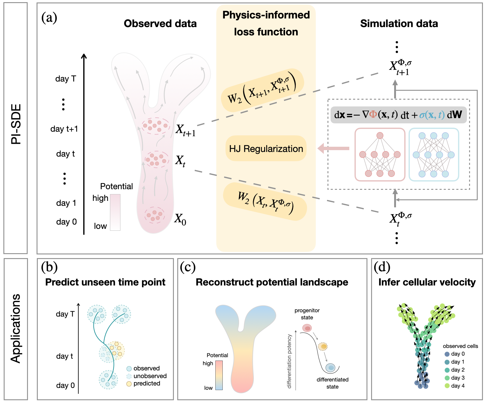

# PI-SDE： a physics-informed neural SDE network for learning cellular dynamics from time-series scRNA-seq data

**Authour**: Qi Jiang and Lin Wan

Learning cellular dynamics through reconstruction of the underlying cellular potential energy landscape (aka Waddington landscape) from time-series single-cell RNA sequencing (scRNA-seq) data is a current challenge. Prevailing data-driven computational methods can be hampered by the lack of physical principles to guide learning from complex data, resulting in reduced prediction accuracy and interpretability when applied to infer cell population dynamics. Here, we propose PI-SDE, a physics-informed neural stochastic differential equation (SDE) framework that combines the Hamilton-Jacobi (HJ) equation and neural SDE to learn cellular dynamics. Grounded in potential energy theory of biological systems, PI-SDE integrates the principle of least action by enforcing the HJ equation when reconstructing cellular potential energy function. This approach not only facilitates accurate predictions, but also improves interpretability, especially in the reconstructed potential energy landscape. Through benchmarking on two real scRNA-seq datasets, we demonstrate the importance of incorporating the HJ regularization term in dynamic inference, especially in predicting gene expression at held-out time points. Meanwhile, the learned potential energy landscape provides biologically interpretable insights into the process of cell differentiation. 

# Datasets
We benchmark the performance of PI-SDE on two time-series scRNA-seq datasets, including pancreatic β-cell differentiation (Veres et al., 2019, https://doi.org/10.1038/s41586-019-1168-5) and mouse hematopoiesis (Weinreb et al., 2020, https://www.science.org/doi/10.1126/science.aaw3381). For pancreatic β-cell differentiation data, we downloaded the data from GEO ([GSE114412](https://www.ncbi.nlm.nih.gov/geo/query/acc.cgi?acc=GSE114412)). For mouse hematopoiesis data, we obtained the original data from https://github.com/AllonKleinLab/paper-data/blob/master/Lineage_tracing_on_transcriptional_landscapes_links_state_to_fate_during_differentiation/README.md.

Detailed pre-processing steps for the data can be found in the catalogue ./data/Veres and ./data/Weinreb

# Experiments

